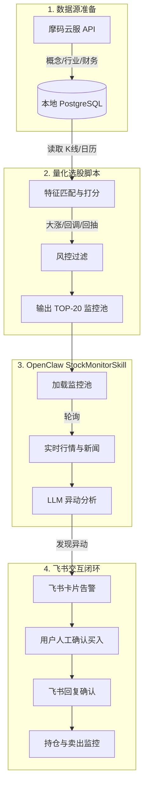

# OpenClaw Stock Monitor 项目方案与计划

## 1. 数据源准备 (Data Source Preparation)
- **本地数据库 (PostgreSQL)**: 确认并连接现有的 `kline_qfq` (前复权日K线)、`stock_list` (股票列表)、`trading_calendar` (交易日历) 表。
- **摩码云服API集成**: 编写 Python 脚本，通过摩码云服 API 定时下载并落库以下增量数据：
  - 概念板块与行业分类数据
  - 技术指标数据 (如均线、MACD等，若不自行计算)
  - 财务基本信息 (估值、市盈率等)

## 2. 量化选股脚本开发 (Python Quantitative Screening)
- **特征提取与打分逻辑**:
  - 提取 T-22 至 T 日的 K 线数据。
  - 识别放量大涨特征 (创业板 > 12%, 非创业板 > 7%)。
  - 识别回调特征 (连续下跌、跌破 25 日均线等)。
  - 识别回抽特征 (3天内迅速回抽、跳空高开等)。
  - 计算回调前 5 日累计涨幅并进行风控过滤 (创业板 < 60%, 非创业板 < 35%)。
- **输出结果**: 根据打分排序，输出 TOP-20 股票列表，保存为 JSON 或存入数据库供 OpenClaw 读取。

## 3. OpenClaw StockMonitorSkill 开发 (StockMonitorSkill Implementation)
- **Skill 框架搭建**: 在 OpenClaw 中创建 `StockMonitorSkill`。
- **数据接入**: 使 Skill 能够读取 TOP-20 监控列表，并对接实时行情接口和市场新闻事件接口。
- **LLM 逻辑封装**: 编写 Prompt，让大模型结合实时异动、基本面(概念/行业/财务)和新闻事件，判断是否符合主力资金突破逻辑。

## 4. 飞书机器人配置与交互闭环 (Feishu Bot Integration)
- **飞书应用创建**: 指导在飞书开放平台创建企业自建应用，获取 App ID 和 App Secret，配置 Webhook 和事件订阅。
- **消息推送**: 实现 OpenClaw 向飞书推送富文本告警卡片 (包含股票代码、现价、异动原因等)。
- **指令接收与状态流转**: 实现 OpenClaw 接收飞书用户的自然语言回复 (如“已买入，成本价XX”)，并自动将股票移入持仓监控池，开启卖出条件监控。

## 架构流程图

